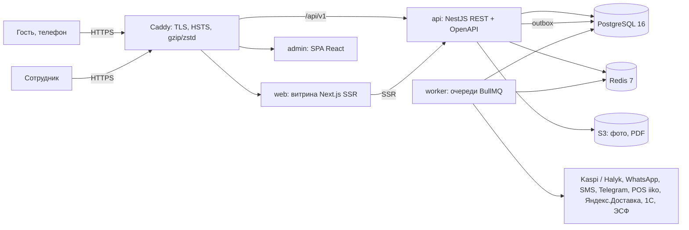

# AULA — заказ, бронирование и банкеты

Платформа для сети ресторанов AULA (Астана): собственный канал заказа доставки и самовывоза с онлайн-оплатой,
бронирование столов и VIP-залов, воронка банкетов и кейтеринга со сметами и документами, подарочные сертификаты,
база гостей и единая админка по всем филиалам с отчётностью. Рассчитана на рост с 2 до 10+ точек, включая франчайзи.

- **Состояние проекта и как его продолжить: [docs/STATUS.md](docs/STATUS.md)**
- ТЗ: [docs/spec/ТЗ-AULA-уровень-3.md](docs/spec/ТЗ-AULA-уровень-3.md)
- Решения по открытым вопросам ТЗ: [docs/decisions.md](docs/decisions.md)
- Эксплуатация (деплой, откат, бэкапы, мониторинг, инциденты): [docs/operations.md](docs/operations.md)
- Инфраструктура (хостинг в РК, сайзинг, DNS/TLS, CDN): [docs/infrastructure.md](docs/infrastructure.md)
- Инструкция для администратора и сотрудников: [docs/admin-guide.md](docs/admin-guide.md), сценарий видео по админке: [docs/admin-video-script.md](docs/admin-video-script.md)
- Схема базы данных: [docs/database-schema.md](docs/database-schema.md), описание API: [docs/openapi.json](docs/openapi.json)

## Архитектура

Модульный монолит с жёсткими границами модулей: один backend (NestJS) и один PostgreSQL, но каждый модуль —
своя схема БД и публичный контракт, поэтому любой модуль можно вынести в отдельный сервис без переписывания.



Процессы (один Docker-образ `aula-api`, разные команды):

| Процесс | Команда | Назначение |
| --- | --- | --- |
| api | `node dist/main.js` | REST API `/api/v1` (витрина `/public`, админка `/admin`, вебхуки `/webhooks`) |
| worker | `node dist/worker.js` | outbox → очереди, интеграции с повторами и очередью неудач, расписания |
| migrate | `node dist/cli/migrate.js` | миграции только вперёд, запускается перед каждой новой версией |
| seed | `node dist/cli/seed.js` | стартовые данные; `SEED_DEMO=true` — демо для dev/staging |

Модули (`apps/api/src/modules`) — границы из ТЗ:

| Модуль | Ответственность |
| --- | --- |
| identity | пользователи, роли по филиалам, филиалы, юрлица, аутентификация |
| catalog | меню, блюда, модификаторы, цены и стоп-лист по филиалам, контент, SEO |
| ordering | корзина, заказы (конечный автомат), зоны доставки, промокоды, курьеры |
| reservation | залы и места, брони с транзакционной проверкой занятости, депозиты |
| banquet | банкетные заявки и воронка, сметы (версии), счета, договоры, акты, ЭСФ |
| payments | платежи (Kaspi, Halyk), возвраты, вебхуки, подарочные сертификаты |
| customers | база гостей по телефону, согласия на обработку ПД, теги, история |
| notifications | WhatsApp, SMS, email, Telegram, лента админки; шаблоны и журнал доставки |
| reporting | отчёты (только чтение), выгрузки XLSX, выгрузка в 1С |
| pos | адаптеры POS (manual, iiko): передача заказов, сопоставление блюд |

Платформа (`apps/api/src/shared`): транзакции и outbox, события и фоновые задачи, журнал действий, файлы,
PDF/XLSX, внешние HTTP-вызовы с маскированием, настройки интеграций (шифруются в БД), лимиты частоты, метрики.
Модуль не обращается к таблицам другого модуля — только через `modules/<m>/public` или события; нарушение
валит CI (eslint-plugin-boundaries). Правила разработки — [docs/development/backend-guide.md](docs/development/backend-guide.md).

### Стек

| Слой | Технологии |
| --- | --- |
| Backend | Node.js 22, NestJS 11, TypeScript, Kysely, class-validator, @nestjs/swagger |
| Данные | PostgreSQL 16 (схема на модуль, JSONB, exclusion constraints), Redis 7 + BullMQ |
| Витрина | Next.js 15 (SSR, next-intl: kk/ru/en), Tailwind CSS 4 |
| Админка | React 19 + Vite, Ant Design, TanStack Query |
| Клиент API | `@aula/api-client` — типы из `docs/openapi.json` (openapi-typescript + openapi-fetch) |
| Файлы | S3-совместимое хранилище (локально — диск или MinIO) + CDN для фото |
| Инфраструктура | Docker, Caddy (автоматический HTTPS), GitHub Actions, GHCR |
| Наблюдаемость | Sentry, pino (JSON-логи) → Loki, Prometheus + Alertmanager (Telegram), Grafana, Uptime Kuma |

## Структура репозитория

```
apps/
  api/                 backend: модули, платформа, CLI (migrate, seed, openapi), тесты, Dockerfile
  web/                 витрина Next.js, Dockerfile (output: standalone)
  admin/               админ-панель React + Vite, Dockerfile (статика через Caddy)
packages/
  api-client/          типизированный клиент API, генерируется из docs/openapi.json
docs/
  spec/                ТЗ
  decisions.md         решения по гипотезам ТЗ
  development/         руководство разработчика backend
  operations.md        эксплуатация: деплой, откат, бэкапы, мониторинг, инциденты
  infrastructure.md    хостинг, сайзинг, топология, DNS/TLS, CDN
  openapi.json         описание REST API (OpenAPI 3)
ops/
  caddy/               reverse proxy (Caddyfile) и раздача статики админки
  deploy/              deploy.sh, rollback.sh, compose.sh — выкатка и откат на сервере
  backup/              бэкап/восстановление/проверка восстановления, образ aula-backup, rclone
  monitoring/          Prometheus, алерты, Alertmanager, Loki/Promtail, Grafana
  build-env/           публичные параметры сборки фронтендов по окружениям
.github/               CI, деплой по тегу, откат, шаблон PR, CODEOWNERS
docker-compose.yml             локальная инфраструктура (PostgreSQL, Redis, MinIO, Mailpit)
docker-compose.prod.yml        staging/production
docker-compose.monitoring.yml  стек мониторинга (опционально)
```

## Быстрый старт (локально)

Нужны: Node.js 22 (`.nvmrc`), pnpm 10 (`corepack enable`), Docker с Compose v2.

```bash
# 1. Инфраструктура: PostgreSQL 16, Redis 7, MinIO (S3), Mailpit
cp .env.example .env              # необязательно: только если нужно поменять порты
docker compose up -d
docker compose ps                 # postgres и redis — healthy, minio-init — exited (0)

# 2. Зависимости
pnpm install

# 3. База: миграции и демо-данные (2 филиала, сотрудники, меню, залы)
pnpm migrate
SEED_DEMO=true pnpm --filter @aula/api seed

# 4. Приложения — каждое в своём терминале
pnpm dev:api        # REST API :3000
pnpm dev:worker     # очереди, интеграции, расписания
pnpm dev:web        # витрина :3001
pnpm dev:admin      # админка :5173
```

Значения по умолчанию в конфигурации API совпадают с `docker-compose.yml`, поэтому для старта `.env` не нужен.
Переопределение — через переменные окружения (полный список: [apps/api/.env.example](apps/api/.env.example)),
например `QUEUE_DRIVER=inline pnpm dev:api` выполняет задачи в процессе API без отдельного воркера.
Витрина и админка читают `apps/web/.env.local` и `apps/admin/.env.local` (примеры — `.env.example` рядом).

Сид выводит в консоль логины: собственник `owner@aula.kz` и администратор `admin@aula.kz` получают временные
пароли (смена при первом входе), демо-сотрудники — пароль, напечатанный сидом.

| Адрес | Что |
| --- | --- |
| http://localhost:3001 | витрина |
| http://localhost:5173 | админ-панель |
| http://localhost:3000/api/v1/docs | Swagger UI (OpenAPI) |
| http://localhost:3000/api/v1/health/ready | готовность API (БД, Redis) |
| http://localhost:8025 | Mailpit — перехваченная почта |
| http://localhost:9001 | консоль MinIO (`aula-minio` / `aula-minio-secret`) |
| localhost:5432 / localhost:6379 | PostgreSQL (`aula`/`aula`/`aula`) / Redis |

Хранилище файлов по умолчанию — локальный диск (`apps/api/storage`). Чтобы работать как в production через S3,
задайте для API `STORAGE_DRIVER=s3` и переменные `S3_*` из закомментированного блока MinIO в `apps/api/.env.example`.

## Команды

```bash
pnpm lint                                     # ESLint во всех пакетах (в API — и границы модулей)
pnpm typecheck                                # tsc --noEmit во всех пакетах
pnpm --filter @aula/api test:unit             # unit-тесты домена и архитектурные проверки
pnpm --filter @aula/api test:integration      # интеграционные тесты на PostgreSQL (docker compose up -d)
TEST_DATABASE_NAME=aula_test_me pnpm --filter @aula/api test:integration   # своя тестовая база
pnpm -r --filter "!@aula/api" run test        # тесты витрины и админки
pnpm openapi                                  # docs/openapi.json + типы @aula/api-client (закоммитить!)
pnpm build                                    # сборка всех пакетов
docker build -f apps/api/Dockerfile .         # образ API (также apps/web, apps/admin; ops/backup — контекст ops/backup)
```

Все эти проверки выполняет CI на каждый pull request; без зелёного CI ветка не мержится (см. [CONTRIBUTING.md](CONTRIBUTING.md)).

## Окружения, деплой, откат

| Окружение | Где | Как обновляется |
| --- | --- | --- |
| local | машина разработчика | `docker compose up -d` + `pnpm dev:*` |
| staging | отдельный сервер, демо-данные, тестовые платежи | автоматически при push тега `v*` |
| production | сервер в РК, данные гостей | тот же тег после ручного подтверждения в GitHub |

```bash
git tag -a v1.4.0 -m "Релиз 1.4.0" && git push origin v1.4.0   # CI → образы → staging → (подтверждение) → production
ops/deploy/rollback.sh                                         # на сервере: откат на предыдущую версию одной командой
```

Подробно — [docs/operations.md](docs/operations.md): подготовка сервера, секреты, миграции (только вперёд,
expand/contract), бэкапы и ежеквартальная проверка восстановления, мониторинг, алерты и действия при инцидентах.

## Документация

| Документ | Для кого |
| --- | --- |
| [docs/spec/ТЗ-AULA-уровень-3.md](docs/spec/ТЗ-AULA-уровень-3.md) | все: требования и условия приёмки |
| [docs/decisions.md](docs/decisions.md) | все: как закрыты гипотезы и открытые вопросы ТЗ |
| [docs/development/backend-guide.md](docs/development/backend-guide.md) | разработчики backend: структура модуля, 12 правил |
| [CONTRIBUTING.md](CONTRIBUTING.md) | разработчики: ветки, PR, ревью, коммиты, миграции, новые модули и интеграции |
| [docs/openapi.json](docs/openapi.json) | разработчики клиентов (витрина, админка, мобильное приложение, портал франчайзи) |
| [docs/operations.md](docs/operations.md) | администратор системы, дежурный |
| [docs/infrastructure.md](docs/infrastructure.md) | владелец инфраструктуры, архитектор |
| [docs/admin-guide.md](docs/admin-guide.md) | сотрудники всех ролей: работа в админке, первый запуск |
| [docs/admin-video-script.md](docs/admin-video-script.md) | запись видеоинструкций по админке |
| [docs/database-schema.md](docs/database-schema.md) | разработчики, DBA: схема БД (генерируется `pnpm --filter @aula/api db:schema-doc`) |
| [docs/development/frontend-guide.md](docs/development/frontend-guide.md) | разработчики витрины и админки |
