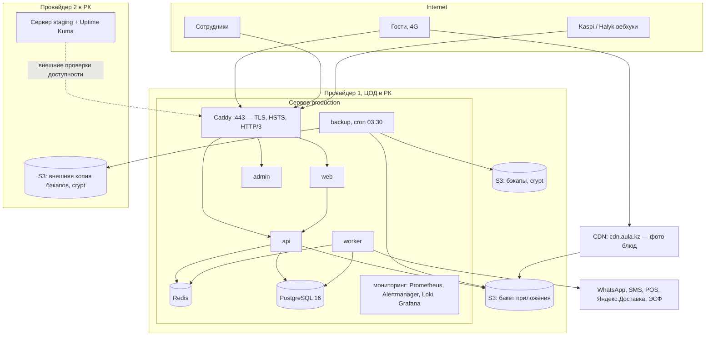

# Инфраструктура AULA

Где и на чём работает система, почему так, сколько ресурсов нужно под нагрузку из ТЗ и как устроены сеть,
DNS, TLS и CDN. Эксплуатация (деплой, откат, бэкапы, алерты) — [operations.md](operations.md).

## Требования, влияющие на инфраструктуру

| Требование ТЗ | Значение |
| --- | --- |
| Пиковая нагрузка | вечер пятницы и предпраздничные дни: до 300 одновременных посетителей витрины, до 60 заказов в час |
| Скорость | каталог — за 2 с на 4G; API — до 300 мс на 95-м перцентиле |
| Доступность | 99,5 % в месяц; падение POS, мессенджера, платёжного провайдера не роняет сайт |
| Безопасность | HTTPS с редиректом, HSTS, лимиты частоты, данные карт не проходят через сервер, ПД — по закону РК |
| Бэкапы | ежедневно, 30 дней, копия в другом регионе или у другого провайдера; RPO ≤ 24 ч, RTO ≤ 4 ч |
| Эксплуатация | Docker, три окружения, CI/CD по тегу, откат одной командой, Sentry, структурированные логи, мониторинг |
| Хостинг | на территории Казахстана — уточнить требование к размещению ПД |
| Передача | доступы оформлены на юрлицо клиента |

## Хостинг в Казахстане

**Рекомендация: production, staging, S3-хранилище и обе копии бэкапов — у провайдеров с дата-центрами на
территории РК.** Основание: Закон РК «О персональных данных и их защите» (№ 94-V от 21.05.2013, ст. 12) требует
хранить персональные данные в базе, расположенной на территории Республики Казахстан. AULA хранит ПД гостей:
телефон, имя, адреса доставки, история заказов, аллергии, согласия; юрлиц — реквизиты и контакты. Окончательное
требование подтверждает юрист клиента (открытый вопрос ТЗ).

Что допустимо за пределами РК — только данные без ПД: CDN для фото блюд и статики (публичный контент),
Sentry (при `sendDefaultPii: false`, без тел запросов; при сомнениях — self-hosted Sentry в РК), счётчики аналитики
(по согласию гостя на cookies). Бэкапы содержат ПД — оба хранилища в РК, данные зашифрованы на стороне сервера
(rclone crypt).

Выбор провайдеров (на discovery; учётные записи — на юрлицо клиента):

- два независимых провайдера облачной инфраструктуры в РК (например, из числа операторов ЦОД в Алматы и Астане) —
  основной (серверы, S3, при желании управляемый PostgreSQL) и второй (внешняя копия бэкапов);
- критерии: S3-совместимое объектное хранилище, управляемый PostgreSQL 16 с разрешёнными расширениями
  `btree_gist`, `pg_trgm`, `citext` (нужны схеме), снимки дисков, SLA ≥ 99,9 %, консоль и API, договор и счета на
  юрлицо в тенге, резервный канал связи ЦОД, поддержка IPv6 (желательно).

## Сайзинг

Оценка нагрузки в пике: 300 посетителей × 1 страница за 10–20 с ≈ 15–30 страниц/с SSR; страницы меню и
филиалов кэшируются (данные — 60 с, Next.js data cache), поэтому до API доходит малая часть. Запросы браузера к API
(корзина, расчёт стоимости, статусы) ≈ 30–80 запросов/с. 60 заказов/ч = 1 заказ в минуту — нагрузка на запись
ничтожна; узкое место — не объём, а задержка, поэтому важны кэш, индексы и один «прыжок» до API.

| Роль | production | staging |
| --- | --- | --- |
| Сервер приложений | 4 vCPU, 8 ГБ RAM, 80–100 ГБ NVMe SSD | 2 vCPU, 4 ГБ RAM, 40 ГБ SSD |
| PostgreSQL 16 | в контейнере на том же сервере (профиль `db`) **или** управляемый: 2 vCPU, 4 ГБ, 20–50 ГБ SSD, автобэкапы/PITR | в контейнере |
| Redis 7 | в контейнере, 512 МБ (AOF) | в контейнере |
| S3 | 10–50 ГБ (фото в нескольких размерах, PDF) | 5 ГБ |
| Хранилище бэкапов | ×2 провайдера, 30 дней: ≈ 30 × дамп (десятки МБ) + файлы | ×1 (или только чтение production для проверок) |

Распределение памяти production (лимиты в `docker-compose.prod.yml`): PostgreSQL ~2 ГБ (`shared_buffers` 1 ГБ),
Redis 0,5 ГБ, api до 1 ГБ, worker до 1 ГБ, web до 768 МБ, admin и Caddy < 200 МБ, стек мониторинга ~1,5 ГБ
(Prometheus, Loki, Grafana; можно вынести на staging-сервер). Запас — под страничный кэш ОС.

Рост: сначала вертикально (8 vCPU / 16 ГБ); затем вторая реплика API (`--scale api=2`, Caddy и Prometheus видят
реплики через DNS Docker; для равномерной балансировки upstream в Caddyfile переводится на `dynamic a api 3000`);
при 10+ филиалах и портале франчайзи — управляемый PostgreSQL с репликой для отчётов. Нагрузочный тест перед
запуском и перед сезоном (k6/Gatling): сценарий «300 посетителей листают меню + 2 оформления в минуту»,
критерий — p95 API ≤ 300 мс и TTFB каталога ≤ 800 мс.

Что обеспечивает p95 ≤ 300 мс: SSR с кэшем данных, same-origin API (нет CORS-preflight — минус круг запроса на 4G),
HTTP/2–3 и сжатие zstd/gzip в Caddy, пул соединений PostgreSQL, индексы и `statement_timeout`, лимиты частоты в Redis,
фото — с CDN, тяжёлые операции (PDF, XLSX, интеграции) — в worker, а не в запросе.

## Топология

- **production**: один сервер с Docker Compose (`docker-compose.prod.yml`); PostgreSQL в контейнере (`COMPOSE_PROFILES=db`)
  или управляемый у того же провайдера. Наружу открыт только Caddy (80/443); API, БД, Redis — во внутренней сети
  Docker `aula-net`.
- **staging**: сервер меньше, у второго провайдера — заодно площадка для проверки восстановления из внешней копии и
  место для Uptime Kuma, которая проверяет production «снаружи». Демо-данные, тестовые платежи (`sandbox`),
  `noindex`.
- **Сетевая безопасность**: firewall (22 — по IP администраторов, 80, 443/tcp+udp), SSH только по ключам, пользователь
  `deploy` без sudo для ежедневной работы, обновления безопасности автоматически, контейнеры приложения без
  capabilities и `no-new-privileges`, секреты в `env/` (0600). По желанию клиента — доступ к `admin.*` только из
  сетей филиалов/VPN (`remote_ip` в Caddyfile).

## CDN и файлы

- Фото блюд и баннеры — в `public/` S3-бакета, отдаются через CDN (`cdn.aula.kz`, CNAME на CDN, origin — бакет).
  Приложение пишет их с `Cache-Control: public, max-age=31536000, immutable`: ключ файла меняется при замене фото,
  поэтому инвалидация не нужна. `S3_PUBLIC_URL=https://cdn.aula.kz` в `env/api.env`, хост — в `IMAGE_HOSTS`
  (`ops/build-env/*.env`) для next/image.
- CDN с точками присутствия в Казахстане/Центральной Азии даёт основной выигрыш «каталог за 2 с на 4G»; это публичный
  контент без ПД, поэтому допустим и CDN вне РК.
- Документы с ПД (сметы, счета, договоры, акты, сертификаты) — в `private/`, **никогда не через CDN**: только
  подписанные ссылки S3 с коротким сроком жизни.
- Бакет: публичное чтение только префикса `public/`, запись — ключом приложения; для бэкапа — отдельный ключ
  только на чтение.

## DNS и TLS

| Запись | Тип | Значение |
| --- | --- | --- |
| `aula.kz`, `www.aula.kz` | A / AAAA | IP сервера production (`www` → редирект на `aula.kz`) |
| `admin.aula.kz`, `api.aula.kz` | A / AAAA | IP сервера production |
| `staging.aula.kz`, `admin.staging.aula.kz`, `api.staging.aula.kz` | A | IP сервера staging |
| `cdn.aula.kz` | CNAME | адрес CDN |
| `aula.kz` | CAA | `0 issue "letsencrypt.org"` (и CA резервного выпуска, если используется) |
| почтовый домен уведомлений | TXT/CNAME | SPF, DKIM, DMARC — чтобы письма со сметами и сертификатами не попадали в спам |

- TTL 300 с на время запуска и миграции, затем 3600 с.
- **TLS** выпускает и продлевает Caddy автоматически (Let's Encrypt, запасной — ZeroSSL): нужен открытый порт 80 и
  записи DNS до первого запуска. HTTP → HTTPS — редирект 308, HTTP/3 включён.
- **HSTS** `max-age=31536000; includeSubDomains` — на всех ответах (Caddy и API). `includeSubDomains` означает, что
  **все** поддомены `aula.kz` должны работать по HTTPS (включая будущие). `preload` — только по решению владельца
  домена после стабилизации.
- Заголовки безопасности в Caddy: `X-Content-Type-Options`, `Referrer-Policy`, `X-Frame-Options`
  (`DENY` для админки и API), `Permissions-Policy`, `X-Robots-Tag` (админка, API, staging — `noindex`). CSP задаёт
  приложение (витрина подключает аналитику и карты).
- Лимит тела запроса — 15 МБ (загрузка фото); лимиты частоты — в приложении (Redis), не на прокси.

## Окружения и их отличия

| | local | staging | production |
| --- | --- | --- | --- |
| Compose | `docker-compose.yml` (только инфраструктура) | `docker-compose.prod.yml` | `docker-compose.prod.yml` |
| PostgreSQL | контейнер `postgres:16` | контейнер (профиль `db`) | контейнер или управляемый |
| S3 | диск или MinIO | бакет staging | бакет production + CDN |
| Почта | Mailpit | тестовый ящик/SMTP | SMTP-провайдер с SPF/DKIM |
| Мониторинг | — | Uptime Kuma (проверяет production) | Prometheus/Alertmanager/Grafana/Loki |
| Бэкапы | — | по желанию; проверка восстановления бэкапов production | ежедневно ×2 провайдера |
