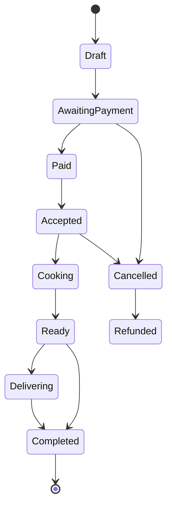
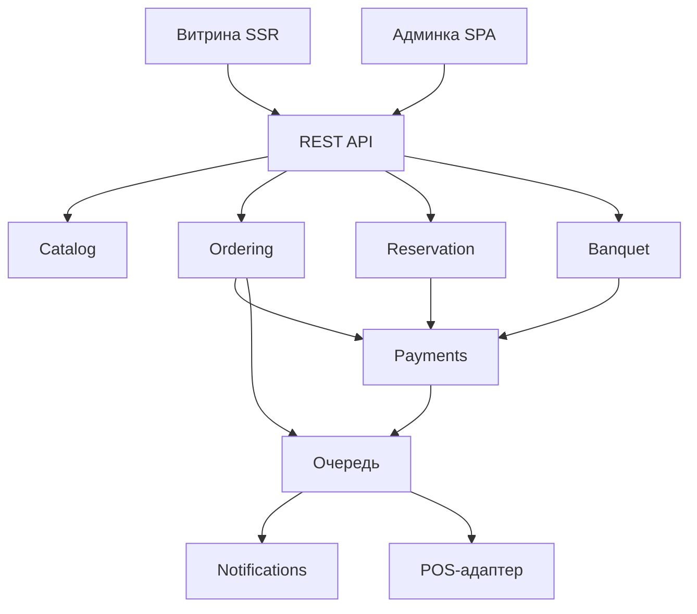

# ТЗ — AULA. Уровень 3: заказ, бронь, банкеты

Sep 25, 2026 · @Azamat

Система для сети AULA (Астана, 2 точки): собственный канал заказа и доставки, бронирование залов, обработка банкетов и кейтеринга, единая админка по филиалам. Требования построены на гипотезах и подлежат проверке на discovery.

## Статус и допущения

Это предпроектное ТЗ на гипотезах. Ни одно требование не подтверждено клиентом, цифр от бизнеса нет. Документ нужен, чтобы зафиксировать решение и оценку до встречи, а после discovery переписывается разделами 4, 5, 9.

Факты из открытых источников на 25.09.2026:

- Два действующих адреса в Астане: E-899 1/1 (ЖК GreenLine Aqua) и Кабанбай батыр 56 (ЖК Garden View). Третья точка (Сарайшык 8, ЖК Атлант) исчезла из профиля и Taplink между 18 и 25 сентября — статус неизвестен.
- Юридическое лицо по сертификату халал: «Express kitchen» ЖШС, адрес регистрации — Кабанбай батыр 56.
- Собственного сайта нет, вместо него Taplink. Бронь — переход в WhatsApp отдельно по каждому филиалу.
- Доставка только через Яндекс.Еду и Wolt. Своего канала заказа нет.
- Направления помимо посадки: банкеты и мероприятия, VIP-залы, кейтеринг, корпоративное обслуживание, подарочные сертификаты, франшиза.

Допущения, принятые для оценки:

- Два филиала на старте, архитектура рассчитана на рост до 10+ точек, включая франчайзи.
- Языки интерфейса: казахский и русский, английский опционально.
- POS-система на точках есть, конкретная не известна.
- Учёт ведётся в 1С или во внешней бухгалтерии.

## Цели и границы

Система решает четыре задачи бизнеса: вернуть комиссию агрегаторов через свой канал заказа, перестать терять заявки на банкеты, убрать ручное ведение броней по филиалам и дать собственнику единую картину выручки по каналам.

Измеримые цели (числа проставляются после discovery):

| Цель | Метрика | Базовое значение | Целевое |
| --- | --- | --- | --- |
| Свой канал доставки | Доля заказов мимо агрегаторов | 0% | уточнить |
| Банкетные заявки | Доля заявок с ответом за 30 минут | уточнить | 95% |
| Банкетные заявки | Потерянных заявок в месяц | уточнить | 0 |
| Бронь | Накладок по залам в месяц | уточнить | 0 |
| Отчётность | Время на сбор дневного отчёта | уточнить | автоматически |

Входит в проект: публичная витрина с меню, онлайн-заказ доставки и самовывоза, онлайн-оплата, бронирование столов и VIP-залов, модуль банкетов и кейтеринга, подарочные сертификаты, база гостей, админ-панель с ролями, отчётность, уведомления, интеграция с POS и платёжным провайдером.

Не входит: мобильные приложения, портал франчайзи и обучение персонала (отдельный проект уровня 4), система лояльности с картами и баллами, складской и производственный учёт, кассовое ПО, дизайн полиграфии, ведение контента после запуска.

## Роли и доступы

Права выдаются ролью, роль привязана к филиалу. Пользователь может иметь разные роли в разных филиалах. Глобальные роли видят все филиалы.

| Роль | Область | Что может |
| --- | --- | --- |
| Гость | публичная часть | смотреть меню, оформлять заказ, бронировать, оставлять заявку на банкет |
| Оператор точки | один филиал | видеть и вести заказы и брони своего филиала, менять статусы |
| Банкетный менеджер | все филиалы | вести банкетные заявки, формировать сметы, выставлять счета |
| Управляющий филиалом | один филиал | всё по своему филиалу, меню и стоп-лист, отчёты филиала |
| Контент-менеджер | все филиалы | меню, блюда, категории, акции, тексты, баннеры |
| Финансы | все филиалы | оплаты, возвраты, выгрузки, отчёты, без доступа к контенту |
| Собственник | все филиалы | всё, включая сводные отчёты и управление пользователями |
| Администратор системы | глобально | пользователи, роли, настройки интеграций, журнал действий |

Обязательно: любое действие, меняющее деньги, статус заказа или состав меню, пишется в журнал действий с указанием пользователя, времени и прежнего значения.

## Функциональные модули

Семь модулей. Каждый — отдельная граница в коде (см. раздел «Архитектура и стек»), общаются через сервисы приложения и события, а не через прямые вызовы чужих моделей.

### 1. Витрина и меню

Главная, страницы филиалов с адресом, часами и картой, каталог блюд по категориям, карточка блюда с фото, составом, весом, ценой, модификаторами и добавками. Поиск и фильтры (вегетарианское, острое, халал, до N тенге). Стоп-лист: блюдо скрывается или помечается недоступным по филиалу. Цена задаётся по филиалу — одно блюдо может стоить по-разному на разных точках. Контент двуязычный: kk и ru, каждое поле переводимое.

SEO: серверный рендеринг, уникальные title и description, микроразметка Restaurant и Menu, sitemap, человекочитаемые URL.

### 2. Заказ доставки и самовывоза

Корзина, промокоды, выбор филиала (автоматически по адресу доставки), расчёт стоимости доставки по зонам (полигоны на карте, минимальная сумма, бесплатная доставка от суммы), выбор времени «как можно скорее» или к определённому времени, комментарий к заказу, бесконтактная доставка.

Оплата онлайн или при получении. Заказ создаётся до оплаты в статусе «ожидает оплаты» и подтверждается только по факту успешного платежа или колбэка от провайдера.

Жизненный цикл заказа — конечный автомат, переходы разрешены только по схеме:

Отмена после оплаты запускает возврат через платёжный модуль, частичный возврат допустим.

### 3. Бронирование столов и залов

Карта залов по филиалам: обычные столы, VIP-залы, юрты или отдельные зоны — конфигурируется, а не зашивается. У места есть вместимость, минимальный депозит и правила: сколько держится бронь без подтверждения, за сколько часов можно отменить.

Гость выбирает филиал, дату, время, количество гостей — система показывает только реально свободные места. Проверка занятости идёт транзакционно: два одновременных запроса на один зал не могут оба пройти. Подтверждение брони по SMS или WhatsApp, напоминание за N часов, отметка «пришли / не пришли» для статистики.

Депозит для VIP-залов оплачивается онлайн и удерживается по правилам отмены.

### 4. Банкеты и кейтеринг

Самый дорогой поток и главный источник окупаемости проекта.

Заявка с формы или из админки: дата, тип мероприятия, количество гостей, филиал или выезд, бюджет, контакт, пожелания. Заявка автоматически назначается банкетному менеджеру и попадает в воронку со статусами: новая, в работе, смета отправлена, согласована, предоплата получена, проведено, отменена.

Конструктор сметы: позиции из меню плюс произвольные позиции (аренда зала, музыканты, оформление, обслуживание), количество, цена, скидка, итог, НДС если применимо. Смета выгружается в PDF под брендом и отправляется ссылкой клиенту.

Предоплата: счёт на оплату для физлица (онлайн-ссылка) и для юрлица (счёт-фактура с реквизитами). Фиксируются оплаты, остаток, срок оплаты.

Документы для юрлиц: договор по шаблону с подстановкой реквизитов, счёт, акт выполненных работ. Реквизиты компании-заказчика хранятся и переиспользуются.

Календарь мероприятий: занятость залов под банкеты синхронна с модулем брони — один зал не может быть одновременно занят банкетом и обычной бронью.

### 5. Подарочные сертификаты

Продажа сертификата на сумму или на набор, генерация уникального кода, PDF с дизайном, отправка на почту или в WhatsApp. Погашение: частичное списание, срок действия, блокировка. Проверка кода из админки и с точки. Отчёт по выпущенным, погашенным и просроченным.

### 6. База гостей

Гость идентифицируется по номеру телефона. Хранится история заказов, броней, банкетов, сумма за период, предпочтения и аллергии, теги (корпоративный клиент, постоянный, банкетный). Сегменты для выгрузки. Согласие на обработку персональных данных фиксируется явно.

### 7. Админ-панель и отчётность

Один интерфейс на все филиалы с переключателем филиала. Очереди: новые заказы, брони, банкетные заявки — с звуковым уведомлением о новом. Управление меню, ценами, стоп-листом, зонами доставки, промокодами, залами, пользователями.

Отчёты: выручка по дням и каналам (доставка, самовывоз, банкеты, сертификаты), средний чек, конверсия витрины в заказ, топ блюд, загрузка залов по дням недели, воронка банкетных заявок, отменённые заказы и причины. Выгрузка в XLSX.

Журнал действий пользователей с фильтрами.

## Интеграции

Каждая внешняя система подключается через адаптер за интерфейсом. Смена провайдера не должна затрагивать код модулей заказа, брони или банкетов.

| Система | Назначение | Приоритет | Риск |
| --- | --- | --- | --- |
| Kaspi Pay | оплата картой и через Kaspi | этап 1 | условия и доступ к API уточняются у банка |
| Halyk epay | резервный или основной эквайринг | этап 1 | выбор зависит от того, где у клиента счёт |
| WhatsApp Business API | уведомления гостю и на точку | этап 1 | нужен верифицированный бизнес-аккаунт и шаблоны сообщений |
| SMS-шлюз | подтверждение брони, коды | этап 1 | низкий |
| POS-система | меню, стоп-лист, передача заказа на кухню | этап 3 | какая именно — не известно, часть POS не имеет открытого API |
| Яндекс.Доставка | логистика своей доставки | этап 3 | договор и тарифы на стороне клиента |
| 1С или бухгалтерия | выгрузка продаж и документов | этап 3 | формат обмена уточняется |
| ЭСФ | счета-фактуры для юрлиц по банкетам | этап 3 | требует ЭЦП и учётной записи в ИС ЭСФ |
| Telegram | дублирование уведомлений персоналу | этап 2 | низкий |
| Аналитика | Google Analytics, Яндекс.Метрика, цели | этап 1 | низкий |

Правила работы с интеграциями:

- Все обращения к внешним API — только асинхронно, через очередь, с повторами и экспоненциальной задержкой.
- Входящие вебхуки (платежи, доставка) обрабатываются идемпотентно: повторный вебхук с тем же идентификатором не меняет состояние второй раз.
- Ответы внешних систем логируются целиком, с маскированием платёжных данных.
- Недоступность POS или мессенджера не должна блокировать приём заказа: заказ принимается, доставка уведомления откладывается.

## Архитектура и стек

Архитектура — модульный монолит с жёсткими границами между модулями. Не микросервисы: на двух филиалах и такой нагрузке они дают только расходы на эксплуатацию. Но границы модулей проводятся сразу так, чтобы любой модуль можно было вынести отдельно, когда появится портал франчайзи.

### Стек

Конкретные версии выбирает команда разработки под свой опыт. Ниже — два рабочих варианта и требования, которые не зависят от выбора.

| Слой | Вариант A | Вариант B |
| --- | --- | --- |
| Backend | Laravel 11 (PHP 8.3) | NestJS (TypeScript) |
| База | PostgreSQL 16 | PostgreSQL 16 |
| Кэш и очереди | Redis + Horizon | Redis + BullMQ |
| Публичная часть | Nuxt 3 или Inertia + Vue 3 | Next.js 15 |
| Админка | Vue 3 + Vite, SPA | React + Vite, SPA |
| Файлы | S3-совместимое хранилище | то же |
| Поиск | PostgreSQL full-text | то же |

Что обязательно при любом выборе: PostgreSQL, а не MySQL — нужны транзакционные блокировки при бронировании и JSONB для гибких полей. Серверный рендеринг публичной части ради SEO. Единый REST API с описанием OpenAPI — по нему потом строится мобильное приложение и портал франчайзи без переписывания бэкенда.

### Границы модулей

Модули: Identity (пользователи, роли, филиалы), Catalog (меню, цены, стоп-лист), Ordering (заказы, доставка, зоны), Reservation (залы, брони), Banquet (заявки, сметы, документы), Payments (платежи, возвраты, сертификаты), Customers (гости), Notifications (каналы уведомлений), Reporting (отчёты, только чтение).

### Правила, чтобы код не стал спагетти

Это не пожелания, это условия приёмки кода.

1. **Модуль не обращается к таблицам и моделям другого модуля.** Только через публичный сервис модуля или через событие. Проверяется автоматически (например, Deptrac для PHP или eslint-boundaries для TS) в CI — нарушение валит сборку.
2. **Бизнес-логика живёт в сервисах уровня приложения**, а не в контроллерах, не в моделях и не в шаблонах. Контроллер только валидирует вход, вызывает сервис, отдаёт ответ.
3. **Каждое действие — отдельный класс с одним публичным методом** (CreateOrder, ConfirmReservation, IssueBanquetInvoice). Так растёт вширь, а не вглубь одного «OrderService» на три тысячи строк.
4. **Интеграции только за интерфейсом.** PaymentGateway, PosClient, NotificationChannel — интерфейс в ядре, реализация в адаптере. Имя провайдера не встречается нигде, кроме конфигурации и самого адаптера.
5. **Статусы — перечисления и конечные автоматы.** Никаких строк в поле status, проставляемых в десяти местах. Переход разрешён только через метод объекта, недопустимый переход бросает исключение.
6. **Деньги — целые числа в тиынах.** Никаких float и никаких вычислений цены на фронтенде. Итог заказа всегда пересчитывается на сервере.
7. **Все внешние вызовы асинхронны**, у каждой задачи есть лимит повторов и очередь неудач.
8. **Никакой бизнес-логики во фронтенде.** Фронт отображает то, что посчитал сервер.
9. **Миграции только вперёд**, схема в репозитории, ручные правки базы на проде запрещены.
10. **Тесты**: покрытие доменного слоя обязательно, плюс интеграционные тесты на заказ, оплату, бронь и банкетную заявку. Без зелёных тестов ветка не мержится.
11. **Мультифилиальность и мультиязычность заложены в схему с первого дня**, даже пока филиала два. Добавить их потом — это переписывание, а не доработка.
12. **Код-ревью обязателен**, прямые коммиты в main запрещены.

## Модель данных и инварианты

Основные сущности и то, что в них нельзя нарушить.

| Сущность | Ключевые поля | Инвариант |
| --- | --- | --- |
| Branch | название, адрес, координаты, часы, зоны доставки | всё, что принадлежит точке, ссылается на branch\_id |
| Dish | переводимое название и описание, фото, вес, состав, категория | цена не хранится в блюде |
| BranchDishPrice | branch\_id, dish\_id, цена, доступность | цена и стоп-лист всегда в разрезе филиала |
| Modifier | группа, опции, цена, обязательность | цена опции тоже в тиынах |
| Order | номер, branch\_id, тип, позиции, суммы, статус, гость | итог пересчитывается на сервере при каждом изменении |
| OrderItem | снимок названия, цены и модификаторов на момент заказа | изменение меню не меняет прошлые заказы |
| DeliveryZone | полигон, минимальная сумма, стоимость, бесплатно от | зоны не пересекаются внутри филиала |
| Venue | branch\_id, тип (стол, VIP-зал, юрта), вместимость, депозит | вместимость проверяется при брони |
| Reservation | venue\_id, интервал времени, гости, статус, депозит | пересечение интервалов по одному venue невозможно |
| BanquetRequest | дата, гости, бюджет, филиал или выезд, менеджер, статус | у заявки всегда есть ответственный |
| Quote | позиции, скидка, итог, версия, PDF | смета версионируется, прошлые версии сохраняются |
| Invoice | плательщик, реквизиты, сумма, срок, оплаты | сумма оплат не превышает сумму счёта |
| Payment | провайдер, внешний id, сумма, статус, идемпотентный ключ | внешний id уникален, повтор не создаёт второй платёж |
| GiftCertificate | код, номинал, остаток, срок, статус | остаток не уходит в минус |
| Customer | телефон, имя, теги, согласие на обработку | телефон уникален и нормализован в формат +7XXXXXXXXXX |
| AuditLog | пользователь, действие, объект, было, стало, время | запись только на добавление, не редактируется |

Общие правила схемы:

- Время хранится в UTC, отображается в Asia/Almaty.
- Удаление логическое (deleted\_at), физическое удаление запрещено для заказов, платежей и броней.
- Переводимые поля вынесены в отдельные таблицы переводов или JSONB с ключами языков, а не в столбцы name\_ru и name\_kk.
- Каждая денежная сумма хранится вместе с валютой, даже пока валюта одна.
- Номера заказов и счетов генерируются последовательностью в разрезе филиала и года.

Конкурентная бронь: проверка занятости и вставка делаются в одной транзакции с блокировкой по venue\_id и пересечению интервала. Проверка «сначала выбрали, потом вставили» без блокировки недопустима — это источник двойных броней в пятницу вечером.

## Нефункциональные требования

Нагрузка и отклик. Расчётный пик — вечер пятницы и предпраздничные дни: до 300 одновременных посетителей витрины, до 60 заказов в час. Страница каталога отдаётся за 2 секунды на 4G, отклик API до 300 мс на 95-м перцентиле. Оформление заказа не должно требовать больше 4 экранов.

Мобильные устройства. Больше 80% трафика ресторанов идёт с телефона, поэтому проектирование начинается с мобильной версии, а не адаптируется под неё.

Доступность. Целевая — 99,5% в месяц. Плановые работы вне часов пик. Падение POS, мессенджера или платёжного провайдера не роняет сайт: заказ принимается, внешнее действие ставится в очередь.

Безопасность. HTTPS с редиректом, HSTS. Пароли — bcrypt или argon2. Ограничение частоты запросов на формы заказа, брони и авторизации. Защита от подбора кодов сертификатов. Данные карт не хранятся и не проходят через сервер — только через платёжного провайдера. Персональные данные обрабатываются по закону РК о персональных данных, согласие фиксируется с датой и версией текста.

Бэкапы. Ежедневный полный бэкап базы и файлов, хранение 30 дней, копия в другом регионе или у другого провайдера. Восстановление проверяется на тестовом стенде минимум раз в квартал. Точка восстановления — не старше 24 часов, время восстановления — до 4 часов.

Инфраструктура и эксплуатация. Docker, три окружения: локальное, staging, production. Развёртывание через CI/CD по тегу, откат на предыдущую версию одной командой. Сбор ошибок (Sentry), структурированные логи, мониторинг доступности и очередей с оповещением. Хостинг на территории Казахстана — уточнить требование по размещению персональных данных.

Передача проекта. Репозиторий передаётся клиенту, доступы к серверам и сервисам оформлены на юрлицо клиента, а не на разработчика. В комплекте: README с развёртыванием, описание OpenAPI, схема базы, инструкция для администратора и видео по админке.

Гарантия и поддержка. Гарантийное устранение дефектов 3 месяца после приёмки. Далее — отдельный договор поддержки, ориентир 10–15% стоимости проекта в год.

## Этапы, сроки и оценка

Три этапа, каждый заканчивается работающей частью в продакшене, а не «внутренней версией».

| Этап | Состав | Срок | Доля стоимости |
| --- | --- | --- | --- |
| 1. Свой канал заказа | витрина, меню, корзина, зоны доставки, оплата, уведомления, базовая админка, 2 филиала | 5–6 недель | 40% |
| 2. Бронь и банкеты | залы и бронирование, депозиты, банкетная воронка, сметы, счета, документы, сертификаты | 5–6 недель | 40% |
| 3. Интеграции и аналитика | POS, Яндекс.Доставка, выгрузка в учёт, ЭСФ, база гостей, отчёты | 3–4 недели | 20% |

Общий срок 13–16 недель при условии, что клиент отвечает на вопросы за 2 рабочих дня и вовремя даёт доступы к Kaspi, WhatsApp Business и POS.

Диапазон стоимости: 4 000 000 – 7 000 000 ₸. Итоговая цифра называется после discovery и зависит от четырёх факторов: какая POS и есть ли у неё API, нужны ли документы для юрлиц и ЭСФ, сколько типов залов и правил брони, нужна ли миграция меню и базы гостей.

Оплата по этапам: 40% предоплата, 30% по сдаче первого этапа, 20% по сдаче второго, 10% по приёмке. Работы вне согласованного объёма оформляются отдельной заявкой на изменение с оценкой срока и стоимости до начала работ.

От клиента требуется: контент (фото блюд, описания, переводы на казахский), доступы к домену и хостингу или согласие на новый, договор с платёжным провайдером, верифицированный аккаунт WhatsApp Business, один ответственный со стороны заказчика с правом принимать решения.

## Открытые вопросы

Без ответов на эти пункты цена и сроки остаются диапазоном. Первые пять — блокирующие: они меняют объём работ, а не детали.

- [ ] Сколько филиалов работает и что произошло с точкой на Сарайшык 8
- [ ] Какая POS-система стоит на точках и есть ли у неё открытый API
- [ ] Сколько банкетных заявок в месяц, средний чек банкета, кто их обрабатывает
- [ ] Нужны ли документы для юрлиц: договоры, счета-фактуры, ЭСФ
- [ ] Сколько заказов в месяц идёт через Яндекс.Еду и Wolt и какая комиссия по договору
- [ ] Сколько типов залов и какие правила брони, депозитов и отмен
- [ ] Есть ли действующие франчайзи и планируется ли портал для них
- [ ] Где обслуживается компания — Kaspi, Halyk или другой банк
- [ ] Ведётся ли учёт в 1С и нужна ли выгрузка
- [ ] Есть ли готовый контент: фото блюд, описания, переводы на казахский
- [ ] Кто со стороны заказчика принимает решения и утверждает бюджет
- [ ] К какой дате нужен запуск и с чем она связана

После ответов переписываются разделы «Функциональные модули», «Интеграции» и «Этапы, сроки и оценка». Остальное остаётся.
